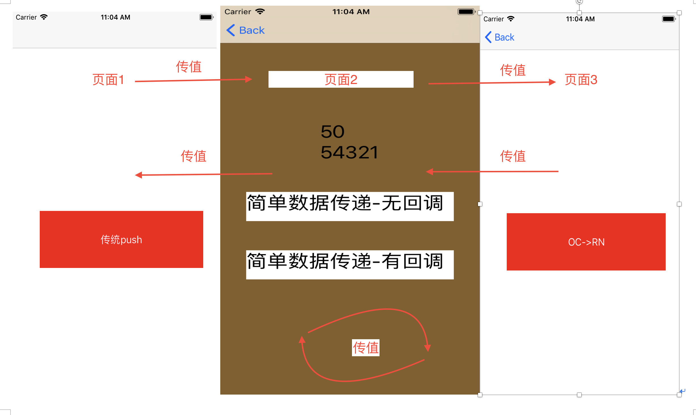

# React Native 和 原生端通信问题(iOS)

#### 两者之间通信的应用场景如下图




**说明**：原生页面1-——> RN页面2(原生的导航栏,换掉主View) ———>原生页面3


### 一、原生传值给RN


#### 方式1：初始化View的时候传值

这是最简单的方式

OC端：

```objective-c
NSURL *jsCodeLocation = [NSURL URLWithString:@"http://localhost:8081/index.ios.bundle?platform=ios"];

    NSDictionary *initPara = @{@"scores" : @[@{@"name" : @"Alex",@"value": @"50"},@{@"name" : @"Joel",@"value": @"10"}]};
    
    RCTRootView *rootView = [[RCTRootView alloc]initWithBundleURL:jsCodeLocation moduleName:@"TestDemo" initialProperties:initPara launchOptions:nil];
    
    self.view = rootView;
```


RN端：

```react
<Text style={styles.text}>
{this.props["scores"][0]["value"]}				
</Text>
```


####方式2：导出常量,即原生给RN传常量

OC端：

```objective-c
- (NSDictionary *)constantsToExport {
    return @{@"a":@"1234",@"b":@"54321"};
}
```


RN端:

```react
<Text style={styles.text}>
{NativeModules.RootViewController.b}			
</Text>
```


#### 方式3:RN端监听原生端发送的消息

>这种方式颇为麻烦，在RN3.0之后，需要自定义类继承自RCTEventEmitter(虚基类)来向RN端发送消息，然后由RN端监听消息才可。


OC端:  

```objective-c
.h
#import <React/RCTBridgeModule.h>
#import <React/RCTEventEmitter.h>

@interface NativeContactionRNManager : RCTEventEmitter<RCTBridgeModule>

-(void)sendMessageWithName:(NSString *)name info:(id)info;

@end
  
.m
 
#import "NativeContactionRNManager.h"

#define kEmitEventName @[@"EventReminder"]

@implementation NativeContactionRNManager

RCT_EXPORT_MODULE();

- (NSArray<NSString *> *)supportedEvents {
    return kEmitEventName;
}

- (void)startObserving{}

- (void)stopObserving{}

-(void)sendMessageWithName:(NSString *)name info:(id)info {
    NSAssert([kEmitEventName containsObject:name], @"发送的messageName不存在");
    [self addListener:name];
    [self sendEventWithName:name body:info];
}
  
 
调用:
	 NativeContactionRNManager *manager = [[NativeContactionRNManager alloc]init];
    [manager setBridge:self.bridge];
    [manager sendMessageWithName:@"EventReminder" info:@{@"name":@"曹		植",@"age":@"100"}];
```


RN端:

```react
import {
	AppRegistry,
	StyleSheet,
	NativeModules,
	NativeEventEmitter,
} from "react-native";

var NativeContactionRNManager = NativeModules.NativeContactionRNManager;
const myEmitter = new NativeEventEmitter(NativeContactionRNManager);

componentWillMount() {		
	myEmitter.addListener('EventReminder',(data)=>{
		console.log(data);
	})
}

componentWillUnmount() {
	myEmitter.remove();
}

```


### 二、RN传值给原生端


#### 方式1：

OC端：

>OC端如果想接收来自RN端的消息，必须实现RCTBridgeModule协议，切要实现`RCT_EXPORT_MODULE()`宏，个宏也可以添加一个参数用来指定在Javascript中访问这个模块的名字。如果你不指定，默认就会使用这个Objective-C类的名字。
>
>```objective-c
>@implementation RootViewController
>
>RCT_EXPORT_MODULE();
>
>@end
>```
>
>还要必须声明要给RN导出的方法，声明通过`RCT_EXPORT_METHOD()`宏来实现：
>
>```objective-c
>RCT_EXPORT_METHOD(addEvent:(NSString *)name location:(NSString *)location)
>{
>  RCTLogInfo(@"Pretending to create an event %@ at %@", name, location);
>  
>  在这个方法里如果要用到传过来的参数，或要修改原生类的成员变量值，需要在这个方法再抛个通知，直接在这个方法修改成员变量实际是不起作用的,实际操作是这样，也没知道原因。
>  
>      [[NSNotificationCenter defaultCenter] postNotificationName:@"RNTOIOSNOTIFICATION" object:self userInfo:@{@"name":name,@"location":location}];
>}
>```


RN端:

```react
import {
	AppRegistry,
	StyleSheet,
	NativeModules,
	...
} from "react-native";

var RootViewController = NativeModules.RootViewController;

调用时:
RootViewController.addEvent("曹峰", "25");

```


#### 方式2：

OC端:

>同样需要实现协议和导出模块名之外，此方式可以实现：当OC端接收到RN端的消息之后再给RN端回调并传值.

```react
RCT_EXPORT_METHOD(RNInvokeOCCallBack:(NSDictionary *)dictionary callback:(RCTResponseSenderBlock)callback) {
    
    RCTLogInfo(@"接收到RN传过来的数据为:%@",dictionary);
  //给RN端回调值
    NSArray *events = [[NSArray alloc] initWithObjects:@"哈哈",@"呵呵", nil];
    callback(@[[NSNull null], events]);
}
```

RN端:

```react
RootViewController.RNInvokeOCCallBack(
			{ name: "jiangqq", description: "http://www.lcode.org" },
			(error, events) => {
				if (error) {
					console.error(error);
				} else {
					alert("回调成功");
				}
			}
		);
```


#### 方式3：略


**更多实现细节参考Demo**


